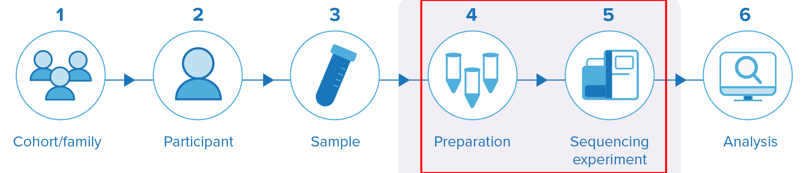

# GA4GH Experiments Metadata Standard

## Purpose of the working group
Our main objective is to specify the minimum information needed to characterise a genomic experiment.

When a researcher downloads a genomic dataset, they typically get CRAM or VCF documents, which are the results of a sequencing experiment. However, these files contain little information on the nature of the experiment itself: are the data from whole genome sequencing, transcriptomics, or another kind of experiment? Are the data for a bulk sequencing or single cell assay? Have techniques been applied to target specific regions of the genome?

Without metadata explaining the context, researchers cannot make sense of results from experiments in genomics, epigenomics, and more. The GA4GH Discovery Work Stream is aiming to produce a minimal checklist of metadata needed to characterise -omics datasets. The Experiments Metadata Standard will provide a dictionary of properties that makes it easier to search for experiments and to understand their results for analysis.

For more information on our group, [please visit our GA4GH web page](https://www.ga4gh.org/product/experiments-metadata-standard/).

## Scope

While the term “metadata” can be very broad (data that describes data), this Discovery Workstream subgroup exclusively focuses on the properties of the methodology and equipment  used in a genomic experiment, and more precisely on library preparation and instrument run. It provides context around the preparation of biological samples into libraries for a given laboratory experiment run, and the execution context for that run. Interoperability with other GA4GH standards will be key to the adoption of the standard.

In the first phase, the group will focus exclusively on genomic sequencing instruments generating reads (high-throughput sequencing experiments, such as WGS, RNA-Seq, and Methyl-Seq). Future specification updates may consider the inclusion of other instruments, quality control metrics and -omics data, such as genotyping arrays, proteomics, and metabolomics, based on the evolving needs within the genomics community. Follow this link to our current working document.

The following topics are therefore considered out of scope (and will remain so): clinical data, biological sample descriptors, downstream data processing, and analysis. The discussions revolve around the content of the checklist, rather than the formats, leaving the latter to the DaMaSC sub-working group.

## How to use this checklist

### Implementing the checklist in your new resource
If you are creating a new resource (dataset / project / platform) and would like to implement this checklist, we suggest having a look at both the "core" and "identifiers" sections, and consider how each property could apply and be inserted in your data model. For any question on specific properties, we can provide help if you open an issue in this GitHub.

### Map your existing resource to the checklist
Please have a look at our [mappings](./mappings/README.md) section.

## Core Properties Checklist
Two documents are being presented for this first version of the checklist:
* [Core](./core.md): This checklist contains properties that are relevant to any sequencing assay.
* [Identifiers](./identifiers.md): This checklist contains identifiers that are relevant to include with a genomic dataset.

## Mappings / Implementations
* [The Mappings section](mappings/README.md) provides a mapping of existing platforms and projects to the GA4GH Experiments Metadata Checklist.

## Future plans
While the current checklist represents the first version of the standard, the GA4GH Experiments Metadata Standard group is actively planning enhancements for future releases. These will include:
* **Categories:** A key upcoming milestone is to define further properties specific to various genomic sequencing domains, such as Transcriptomics, Single-Cell Sequencing, Methylation, and Targeted Sequencing. Progress in each category will **depend on the level of engagement from the respective communities** to help shape and validate these specific properties.
* **Ontologies:** As we suggest ontologies, guided by GA4GH TASC recommendations, we aim to cover the necessary terms to describe each concept, where appropriate. Initial work has focused on instrument-related terms using OBI and GENEPIO, and this effort will continue for other properties.
* **Schema:** Providing an optional schema that implementers can adopt to support the checklist, without making its use mandatory.
* **Involvement with Beacon:** Enabling Beacon searches on terms covered by the checklist. For instance, finding all RNA-Seq experiments or data that was sequenced using a specific platform. Including the [GA4GH Beacon](https://github.com/ga4gh-beacon/specification-v2) and the [GA4GH Discovery Search](https://github.com/ga4gh-discovery/search-api).
* **Supporting Data Generators/repositories:** We are actively working on supporting implementations of the standard in the wider data ecosytems that help to generate, store and surface genomics data.
* **Supporting Data Analysis:** We are actively working on supporting data analysis tools that implement the standard, including the [GA4GH Data Analysis Service](https://github.com/ga4gh-daks/ga4gh-daks-specification).
* **Comments received:** Many issues exist in this GitHub repository, that have been assigned to upcoming versions.

## Documentation

### Introductory video
* [This video](https://us02web.zoom.us/rec/share/Kmd0MLvoPVKDIDx4cp8LdAteGdZM30EKtA33MRRnZ7IBWt6xXtvdFLxF8nsCTKWQ.w1tOxxUcQ8WMouBi) explains the rationale behind the creation of the Experiments Metadata Checklist, highlighting key use cases and outlining future plans.
* [The slides](https://docs.google.com/presentation/d/1L1hDdw002gZL4d9pnUtJXI1R5WFmg3ta-gnD763DIH8/edit) are also available.

### Relevant links
* [Record of past decisions](https://docs.google.com/document/d/1zyIij2YPpI9J8uJKH71mzPLK-vP7Nza90BZ8zkd56og/edit?tab=t.0#bookmark=id.4js2a3jhlsa6)
* [Meetings Agenda and Minutes](https://docs.google.com/document/d/1FPgOT39dINkeVj0S4oeumzJcooGOcVcCIIGc4icXoyU/edit)
* [The Progress flowchart](documentation/progress.md) outlines the steps taken by the Experiments Metadata group in developing the checklist.
