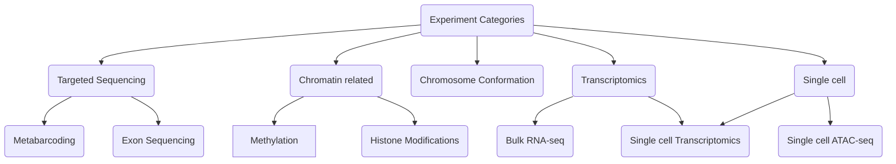

# Experiment Categories

```mermaid
flowchart
    EC(Experiment Categories)-->TA
    EC-->CHR
    EC-->CHC
    EC-->TR
    EC-->SC
    
    TA(Targeted Sequencing)-->MB(Metabarcoding)
    TA-->EX(Exon Sequencing)
    CHR(Chromatin related)-->Methylation
    CHR-->HI(Histone Modifications)
    CHC(Chromosome Conformation)
    TR(Transcriptomics)-->BU(Bulk RNA-seq)
    TR-->SCTRNA(Single cell Transcriptomics)
    SC-->SCTRNA
    SC(Single cell)-->SCATAC(Single cell ATAC-seq)
```