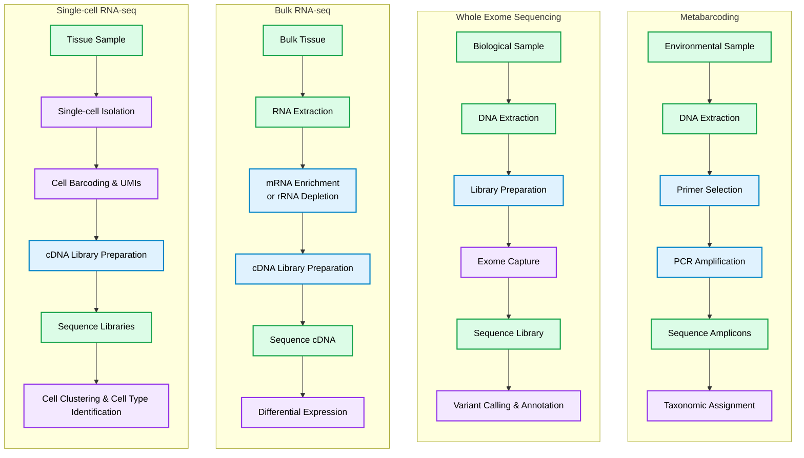

# Combined Experiments Flows

```mermaid
flowchart TD

%% Styles
classDef common_elements fill:#dcfce7,stroke:#16a34a,stroke-width:2px
classDef relatively_common fill:#e0f2fe,stroke:#0284c7,stroke-width:2px
classDef probably_unique fill:#f3e8ff,stroke:#9333ea,stroke-width:2px
classDef default fill:#ffffff,stroke:#333,stroke-width:2px,color:#000

%% ==========================
%% METABARCODING
%% ==========================

subgraph MB["Metabarcoding"]
direction TB

MB1[Environmental Sample]
MB2[DNA Extraction]
MB3[Primer Selection]
MB4[PCR Amplification]
MB5[Sequence Amplicons]
MB6[Taxonomic Assignment]

MB1 --> MB2 --> MB3 --> MB4 --> MB5 --> MB6
end

%% ==========================
%% EXOME
%% ==========================

subgraph WES["Whole Exome Sequencing"]
direction TB

WE1[Biological Sample]
WE2[DNA Extraction]
WE3[Library Preparation]
WE4[Exome Capture]
WE5[Sequence Library]
WE6[Variant Calling & Annotation]

WE1 --> WE2 --> WE3 --> WE4 --> WE5 --> WE6
end

%% ==========================
%% BULK RNA-SEQ
%% ==========================

subgraph BRNA["Bulk RNA-seq"]
direction TB

BR1[Bulk Tissue]
BR2[RNA Extraction]
BR3[mRNA Enrichment<br/>or rRNA Depletion]
BR4[cDNA Library Preparation]
BR5[Sequence cDNA]
BR6[Differential Expression]

BR1 --> BR2 --> BR3 --> BR4 --> BR5 --> BR6
end

%% ==========================
%% SINGLE CELL RNA-SEQ
%% ==========================

subgraph SCRNA["Single-cell RNA-seq"]
direction TB

SC1[Tissue Sample]
SC2[Single-cell Isolation]
SC3[Cell Barcoding & UMIs]
SC4[cDNA Library Preparation]
SC5[Sequence Libraries]
SC6[Cell Clustering & Cell Type Identification]

SC1 --> SC2 --> SC3 --> SC4 --> SC5 --> SC6
end

%% Classes
class MB1,MB2,WE1,WE2,BR1,BR2,SC1 common_elements
class MB3,MB4,WE3,BR3,BR4,SC4 relatively_common
class MB6,WE4,WE6,BR6,SC2,SC3,SC6 probably_unique
class MB5,WE5,BR5,SC5 common_elements


```
