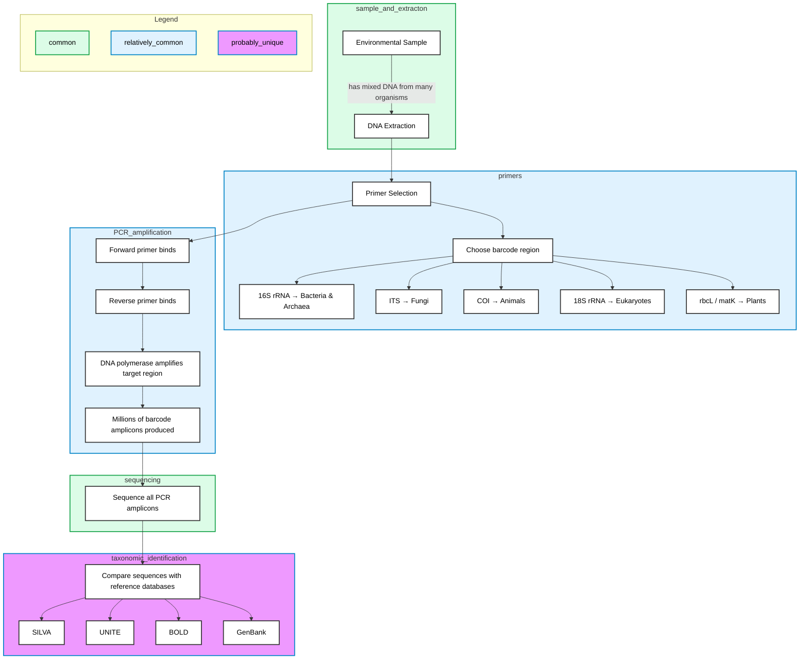

# Metabarcoding Typical Flow
The colouration legend illustrates the commonality metadata for other experimental assays.

```mermaid
flowchart TD
    classDef common_elements fill:#dcfce7,stroke:#16a34a,stroke-width:2px
    classDef relatively_common fill:#e0f2fe,stroke:#0284c7,stroke-width:2px
    classDef probably_unique fill:#e9f,stroke:#0284c7,stroke-width:2px
    
 

    subgraph sample_and_extracton
            A[Environmental Sample] --"has mixed DNA from many organisms"--> B[DNA Extraction]

    end

    B --> D[Primer Selection]
    subgraph primers
        D --> D1["Choose barcode region"]
        D1 --> D2["16S rRNA → Bacteria & Archaea"]
        D1 --> D3["ITS → Fungi"]
        D1 --> D4["COI → Animals"]
        D1 --> D5["18S rRNA → Eukaryotes"]
        D1 --> D6["rbcL / matK → Plants"]
    end

    subgraph PCR_amplification
        D --> E1["Forward primer binds"]
        E1 --> E2["Reverse primer binds"]
        E2 --> E3["DNA polymerase amplifies target region"]
        E3 --> E4["Millions of barcode amplicons produced"]
    end
    E4 --> F1

    subgraph sequencing
        F1["Sequence all PCR amplicons"]
    end

    subgraph taxonomic_identification
        F1 --> G1["Compare sequences with reference databases"]
        G1 --> G2["SILVA"]
        G1 --> G3["UNITE"]
        G1 --> G4["BOLD"]
        G1 --> G5["GenBank"]
    end


        %% The Legend Subgraph
    subgraph Legend ["Legend"]
        direction TD
        common 
        relatively_common
        probably_unique
    end

    %% Assign the class to multiple nodes
    class sequencing,common,sample_and_extracton common_elements;
    class PCR_amplification,primers,relatively_common relatively_common;
    class taxonomic_identification,probably_unique probably_unique;
    
classDef default fill:#ffffff,stroke:#333,stroke-width:2px,color:#000000;

```
