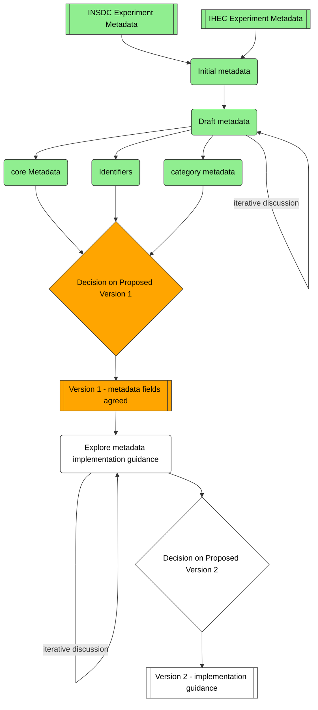

# Progess Flow of the GA4GH Experiments Metadata

```mermaid
flowchart
    INSDC[[INSDC Experiment Metadata]]-->initial
    IHEC[[IHEC Experiment Metadata]]-->initial
    initial(Initial metadata)-->drafting
    drafting(Draft metadata)--iterative discussion-->drafting
    drafting-->core
    drafting-->ids
    drafting-->cats
    core(core Metadata)
    ids(Identifiers)
    core-->v1_decis
    ids-->v1_decis
    cats(category metadata)-->v1_decis
    v1_decis{Decision on Proposed Version 1}
    v1_decis-->v1
    v1[[Version 1 - metadata fields agreed]]-->drafting_imp
    drafting_imp(Explore metadata implementation guidance)--iterative discussion-->drafting_imp
    drafting_imp-->v2_decis
    v2_decis{Decision on Proposed Version 2}-->v2
    v2[[Version 2 - implementation guidance]]

    %% Styling: default all nodes green; v1 orange; v2 white
    classDef default fill:#90EE90,stroke:#333,stroke-width:1px,color:#000;
    classDef in_progress fill:orange,stroke:#333,stroke-width:1px,color:#000;
    class v1_decis in_progress;
    class v1 in_progress;
    classDef to_do fill:#FFFFFF,stroke:#333,stroke-width:1px,color:#000;
    class v2 to_do;
    class v2_decis to_do;
    class drafting_imp to_do;
    
    
```
